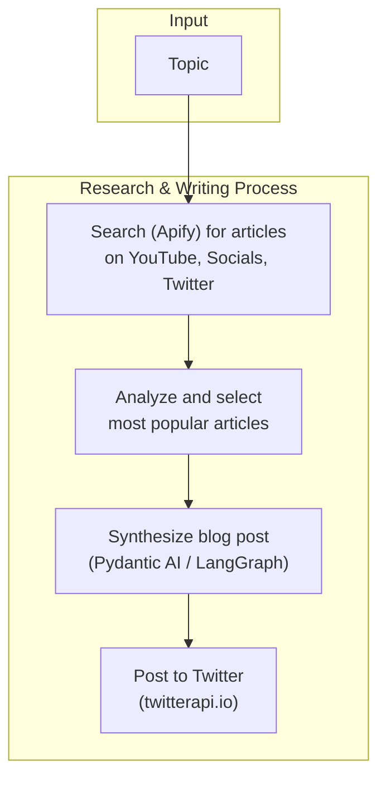

# Research Writer Agent

An agent that researches for a given topic, finds the most popular, recent and relavent articles.
The agent should search youtube and socials, as well as twitter. 
It should validate the "hottness" of the articles and pic the most popular one , the ones that will get the most attention.
It should then synthesis it's own blog post and then post on twitter. 

## Tech Stack 

Core technology: python, poetry , prisma
AI : pydantic ai (agent framework), langgraph
APIs: apify (for searching), twitterapi.io (for pulling in tweets and posting tweets)

## Architecture Overview

